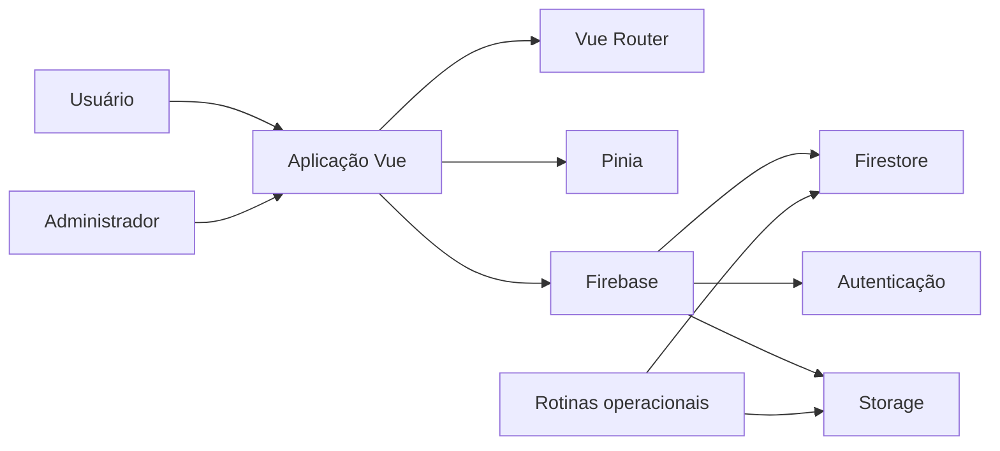

# Agenda Arroio do Sal

Aplicação web para organizar agendamentos e rotinas administrativas em um contexto local.

O projeto explora uma necessidade concreta: permitir que usuários e administradores operem o mesmo serviço com responsabilidades, fluxos e níveis de acesso diferentes.

## Em um minuto: problema, solução e evidências

- **Problema:** permitir agendamentos e administração em fluxos distintos, preservando controle de acesso e operações de manutenção.
- **Escopo do projeto:** aplicação pública de portfólio; participação individual e utilização real por usuários não são quantificadas aqui.
- **Solução documentada:** interface Vue, estado com Pinia, serviços Firebase, separação de ambientes e scripts para backup.
- **Tecnologias:** Vue 3, TypeScript, Firebase/Firestore, Vite, Jest e ferramentas de qualidade.
- **Resultado verificável:** o repositório apresenta código e comandos de teste, build e backup em `package.json`. Isso demonstra mecanismos implementados/configurados, **não** disponibilidade ou eficácia comprovada em produção.

**Como verificar:** examine [package.json](package.json), `src/` e `scripts/backup.js`; execute os testes em ambiente próprio com credenciais de desenvolvimento.

## Evidências no código (inspeção de outubro de 2026)

| Funcionalidade implementada no repositório | Onde conferir | Limite da evidência |
| --- | --- | --- |
| Login Google por popup, atualização do estado do usuário e redirecionamento conforme cadastro | [LoginGoogle.vue](src/components/auth/LoginGoogle.vue) | Fluxo identificado no código; não foi testado contra Firebase real |
| Backup manual e automático com exportação de quatro coleções do Firestore para o Storage | [backup.js](src/services/backup.js) | Código presente; não há comprovação de execução periódica em produção |
| Registro de status e tamanho dos backups, com período de retenção configurado em 30 dias | [backup.js](src/services/backup.js) | **Ponto de atenção:** a rotina de limpeza usa `deleteObject` e `deleteDoc`, mas essas funções não aparecem nos imports inspecionados; execução e retenção devem ser corrigidas/validadas antes de qualquer promessa operacional |

**Resultado demonstrável:** fluxos e rotinas de aplicação escritos no repositório. **Não demonstrado:** usuários atendidos, disponibilidade de serviço, sucesso dos backups ou tempo economizado.

## Visão do produto

A aplicação combina uma experiência pública de agendamento com recursos administrativos para gestão, acompanhamento e proteção dos dados.

O interesse técnico do projeto está na integração entre:

- interface reativa;
- autenticação e autorização;
- persistência em nuvem;
- ambientes separados;
- tarefas operacionais;
- backup e restauração;
- testes e qualidade automatizada.

## Capacidades

- criação e acompanhamento de agendamentos;
- área administrativa;
- autenticação e controle de acesso;
- visualização de dados e indicadores;
- backup manual e automático;
- restauração controlada;
- retenção e gerenciamento de backups;
- execução com ambientes de desenvolvimento, staging e produção.

## Arquitetura



## Stack

**Aplicação**  
`Vue 3` · `TypeScript` · `Vite` · `Pinia` · `Vue Router`

**Interface**  
`Tailwind CSS` · `Heroicons` · `Chart.js` · `VueUse`

**Dados e operação**  
`Firebase` · `Firestore` · `Firebase Admin` · `Node Cron`

**Qualidade**  
`Jest` · `Vue Test Utils` · `ESLint` · `Prettier` · `Husky`

## Organização

```text
src/
├── admin/          # fluxos e telas administrativas
├── components/     # componentes reutilizáveis
├── router/         # rotas e navegação
├── services/       # integração com serviços externos
├── views/          # páginas da aplicação
├── App.vue
└── main.ts

scripts/
└── backup.js       # rotinas de backup
```

## Ambientes

O projeto possui comandos específicos para desenvolvimento, staging e produção.

```bash
npm run dev
npm run dev:staging
npm run dev:prod
```

Também é possível executar a aplicação com os emuladores do Firebase:

```bash
npm run dev:emulators
```

## Execução local

```bash
git clone https://github.com/BrunoCesarAngst/agenda-arroio.git
cd agenda-arroio
npm install
cp .env.example .env
npm run dev
```

As credenciais e identificadores do Firebase devem ser configurados por ambiente. Não publique arquivos `.env` nem chaves administrativas.

## Validação

```bash
npm run test:unit
npm run test:coverage
npm run lint
npm run build
```

## Operação de backup

Backup imediato:

```bash
npm run backup:now
```

Rotina contínua:

```bash
npm run backup
```

A restauração substitui dados existentes e deve ser tratada como uma operação administrativa crítica. Antes de executá-la, preserve um backup verificável do estado atual.

## Decisões de engenharia demonstradas

- separação entre experiência pública e administração;
- configuração explícita por ambiente;
- integração entre aplicação web e tarefas operacionais;
- proteção de dados por backup e retenção;
- comandos verificáveis para teste, lint e build;
- uso de estado centralizado e roteamento tipado no front-end.

## Estado do projeto

Este é um projeto público de portfólio e experimentação aplicada. O código deve ser avaliado como parte de uma trajetória de evolução técnica, não como um serviço municipal oficial.

---

[Perfil de Bruno César Angst](https://github.com/BrunoCesarAngst) · [Site](https://brunoangst.com.br/)
